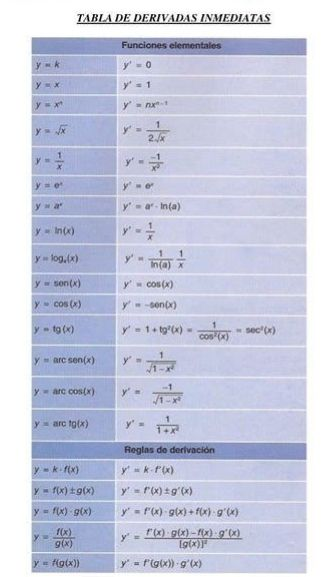
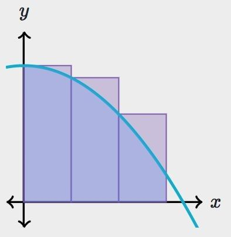
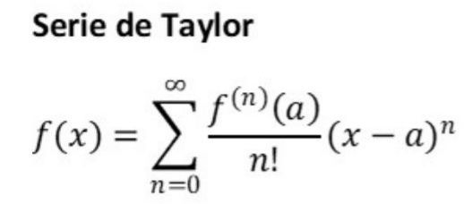

 #Proyecto de Análisis matemático!

## Temas

1. Tema4: **Derivación** (Principal).
Desarrollo de un programa que dada una función de varias variables permita derivar con respecto a cualquiera de sus variables.
2. Tema3: **Integración** (Adicional).
Desarrollo de un programa que dada una función permita calcular aprocimadamente su integral en un intervalo dado.
3. Tema5: **Serie** (Adicional).
Desarrollo de un programa que dada una función, permita hallar los primeros n términos de su serie de Taylor. la serie puede ser centrada.

## Expresiones

Una expresión matemática viene dada por la aplicación de operadores sobre miembros, donde estos pueden ser unarios o binarios y a su vez estos pueden ser expresiones, donde cada operador tiene cierta prioridad en la evaluación de la misma.Sebre estas se pueden llevar a cabo diferentes acciones como pueden ser la derivación o la integración. para la representación de expresiones en este proyecto, mediante el lenguaje de programación c#, se hace uso de una clase abstracta que define el comportamiento de una expresión,luego se especifican los diferentes tipos de espresiones a tener en cuenta para satisfacer la iteraccíon con los usuarios, diganse las expresiones dadas por suma, multiplicación, ecpresiones trigonometricas entre otras. 
Estas se definen de modo que dada la entrada por el usuario en string puedan ser trabajadas e intepretadas por nuestro programa,especificando prioridad de operadores, si es una variable, como se debe extraer, como se imprime, su modo de evaluarse y el modo en que se derivan.

## Derivación

La derivación es un concepto esencial para determinar los espacion tangentes sobre determinadas variedades diferenciable, sus cualidades, propiedades y consecuencias.Se aplica e aquellos casos en que es necesario medir la rapidez con que se produce el cambio de una magnitud o situación y es una herramienta de cálculo fundamental en los estudios de Física, Química y Biología.
Para la derivación de los distintos tipos de expresiones se aplican las reglas principales del calculo de derivadas y la forma particular en que deriva cada una.

Observese como las expresiones que son constantes derivan como 0:

```cs
 public override Expression Derivate(char variable)
        {
            if (visual == variable.ToString())
                return new ConstantOrVariable("1");

            return new ConstantOrVariable("0");
        }
```

De igual modo se emplean la forma de derivar suma de expresiones como la derivada de cada miembro de la suma:

```cs

        public override Expression Derivate(char variable)
        {

            return new Sum(visual, left.Derivate(variable), right.Derivate(variable));

        }
```

Para la multiplicación se suma la derivada del miembro izquierdo por el derecho mas el miembro izquierdo por la derivada del derecho.:

```cs
 public override Expression Derivate(char variable)
        {
            return new Sum("+", new Multiply(visual, left.Derivate(variable), right), new Multiply(visual, left, right.Derivate(variable)));
        }

```

En la división  la derivada del numerador por el denominador restado con el numerador por la derivada del denominador y tod esto se divide  por el denominador al cuadrado:

```cs
 public override Expression Derivate(char variable)
        {
            return new Divide(visual, new Minus("-", new Multiply("*", left.Derivate(variable), right), new Multiply("*", left, right.Derivate(variable))), new Exponent("^", right, new ConstantOrVariable("2")));
        }
```

Asi se lleva a cabo la derivación siguiendo las reglas y la derivación por medio de tablas, ahora con el resto de expresiones se sigue el mismo procedimiento siempre velando por la aplicación de la regla de la cadena, que es el modo de trabajar derivada de expresiones compuestas. Donde  **f(g(x))= f'(g(x))*g'(x)**.



# Integración!

La integración es un concepto fundamental del cálculo y el análisis matemático. Básicamente una integral es una generalización de la suma de infinitos sumandos, infinitesimalmente pequeños. Se utiliza fundamentalmentepara el calculo de áreas y volúmenes de regiones y sólidos de revolución.
La integral de Riemann se define en términos de sumas de Riemann, donde se divide un intervalo [a,b] cerrado en n subintervalos que van desde  x(i) hasta x(i+1) y se toma un punto m(i) interior a ese intervalo i que es evaluado en la función que se desea integral, luego se define como la suma de cada multiplicación de f(m(i))*[x(i+1)-x(i)],asi calculamos el area de cada rectangulo interior al area que toma la región de la función.
Se lleva a cabo este procedimiento rn la clase **IntegralDefinida.cs**.
Se definión la suma de doubles en strings para cancelar el error generado al dividir,sumar y multiplicar miles de veces números tan pequeños al hacer la multiplicaci'on,suma y resta comunes se llegaria a obtener resultados un poco distorsionados, es decir mediantr estas operaciones que definimos se dismunuye el error y se acerca mas al valor de la integral esperado.



# Taylor



En matemática, una serie de Taylor es una aproximación de funciones mediante una serie de potencias o suma de potencias enteras de polinomios como ( x − a )^n  llamados términos de la serie, dicha suma se calcula a partir de las derivadas de la función para un determinado valor o punto  a suficientemente derivable sobre la función y un entorno sobre el cual converja la serie. 
Además de la obvia aplicación de utilizar funciones polinómicas en lugar de funciones de mayor complejidad para analizar el comportamiento local de una función, las series de Taylor tienen muchas otras aplicaciones.Algunas de ellas son: análisis de límites y estudios paramétricos de los mismos, estimación de números irracionales acotando su error, la regla de l'Hôpital para la resolución de límites indeterminados, estudio de puntos estacionarios en funciones (máximos o mínimos relativos o puntos sillas de tendencia estrictamente creciente o decreciente), estimación de integrales, determinación de convergencia y suma de algunas series importantes, estudio de orden y parámetro principal de infinitésimos.